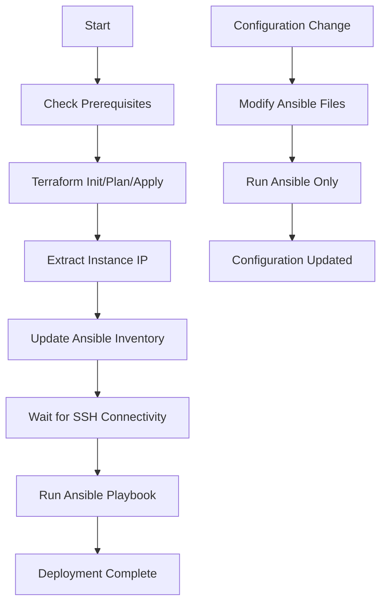

# Architecture Overview

## Design Philosophy

This project implements a **separation of concerns** approach using complementary Infrastructure as Code tools:

- **Terraform**: Manages immutable infrastructure (networking, compute, storage)
- **Ansible**: Manages mutable configuration (software, services, user environment)

## Directory Structure

```
oci-arm-instance/
├── terraform/                 # Infrastructure as Code
│   ├── main.tf                # OCI resources definition
│   ├── variables.tf           # Input variables with validation
│   ├── outputs.tf             # Resource outputs
│   ├── cloud-init.yaml        # Minimal VM initialization
│   ├── terraform.tfvars       # User configuration (not in git)
│   └── terraform.tfvars.example
├── ansible/                   # Configuration Management
│   ├── playbook.yml           # Main configuration playbook
│   ├── inventory.yml          # Host inventory
│   ├── ansible.cfg            # Ansible configuration
│   ├── templates/             # Jinja2 templates
│   │   ├── bashrc_dev.j2      # Development environment
│   │   └── motd.j2            # Welcome message
│   ├── requirements.yml       # Ansible collections
│   └── requirements.txt       # Python packages
├── deploy.sh                  # Deployment orchestration script
├── setup.sh                   # Local environment setup
└── README.md                  # Documentation
```

## Infrastructure Layer (Terraform)

### Resources Managed
- **Virtual Cloud Network (VCN)**: Private network with DNS
- **Internet Gateway**: Public internet access
- **Security Lists**: Firewall rules (SSH, HTTP/HTTPS)
- **Subnet**: Private subnet with public IP assignment
- **Compute Instance**: ARM-based VM with minimal cloud-init

### Why Terraform for Infrastructure?
- **State Management**: Tracks resource dependencies and state
- **Planning**: Shows exactly what will be changed before applying
- **Validation**: Ensures configuration correctness before deployment
- **Immutability**: Infrastructure changes are intentional and tracked

## Configuration Layer (Ansible)

### Services Managed
- **System Updates**: Package updates and security patches
- **Docker**: Container runtime with user permissions
- **Node.js**: JavaScript runtime with global packages
- **Python**: Development environment with pip/venv
- **VSCode**: Editor with extensions
- **Kubernetes**: k3s cluster with kubectl and Helm
- **User Environment**: Aliases, functions, and customizations

### Why Ansible for Configuration?
- **Idempotency**: Can be run multiple times safely
- **Modularity**: Tagged tasks for selective execution
- **Templating**: Dynamic configuration based on host facts
- **No Agent**: Uses SSH, no additional software on target

## Deployment Flow



## Benefits of This Architecture

### 🔄 **Rapid Iteration**
- Configuration changes don't require VM redeployment
- Test different software versions quickly
- Roll back configuration changes easily

### 🏗️ **Infrastructure Stability**
- Network and compute resources remain stable
- Infrastructure changes require explicit planning
- Clear separation between infrastructure and configuration

### 🎯 **Targeted Updates**
- Use Ansible tags to update specific components
- Test individual services without affecting others
- Minimal downtime for configuration changes

### 📊 **Observability**
- Terraform state shows infrastructure status
- Ansible logs show configuration changes
- Clear audit trail for all changes

## Common Patterns

### Full Deployment
```bash
./deploy.sh deploy
```
- Provisions infrastructure with Terraform
- Configures services with Ansible
- Updates inventory automatically

### Configuration-Only Updates
```bash
./deploy.sh configure
# OR
ansible-playbook -i inventory.yml playbook.yml --tags docker
```
- Modifies existing instance without redeployment
- Can target specific services or components
- Maintains infrastructure state

### Infrastructure Updates
```bash
cd terraform/
terraform plan && terraform apply
```
- Changes to networking, compute, or storage
- Requires careful planning and review
- May trigger instance replacement if needed

## Security Considerations

### Infrastructure Security
- **Network Isolation**: Private VCN with controlled access
- **Security Lists**: Minimal required ports (22, 6443, 10250)
- **SSH Keys**: Key-based authentication only
- **Tailscale**: Zero-trust mesh networking

### Configuration Security
- **Least Privilege**: Services run as non-root where possible
- **Package Validation**: Official repositories and GPG verification
- **Secret Management**: Sensitive data in Terraform variables
- **Firewall**: UFW configuration available via Ansible

## Scaling and Extensions

### Adding Services
1. Add tasks to `ansible/playbook.yml`
2. Create appropriate tags for selective deployment
3. Test with `--check` mode first
4. Deploy with `--tags new-service`

### Multiple Environments
1. Create environment-specific inventory files
2. Use Ansible group variables for environment differences
3. Maintain separate Terraform workspaces if needed

### Multi-Instance Deployment
1. Modify Terraform to create multiple instances
2. Update Ansible inventory with all hosts
3. Use Ansible host groups for different roles

This architecture provides a solid foundation for development infrastructure that can evolve with changing requirements while maintaining stability and security.